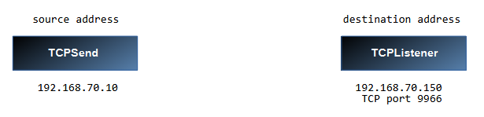
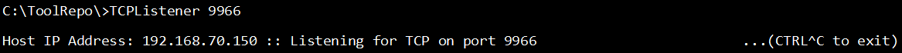
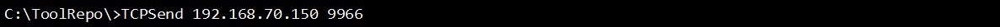
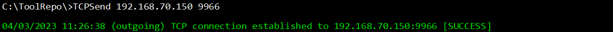
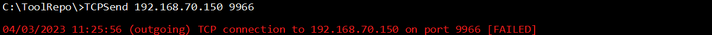
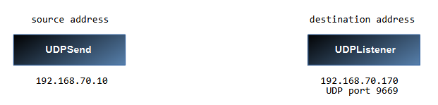
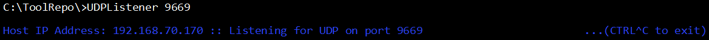
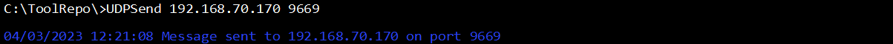
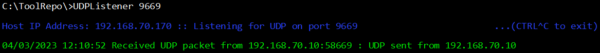

## TCP and UDP Testing Tools for Windows and Linux

These console apps, written in C#, were conceived and born out of need.

I wanted end-to-end testing between two Windows nodes for both TCP and UDP.

If I am setting up new infrastructure, I may not have the luxury of having the applications and servers ready and online at the same time.  

I need to test connectivity between two endpoints.

For TCP, I got tired of the long slow process of using telnet, the host and port, then having to break out of the session.

I also could not find a simple way to test UDP easily between two Windows nodes.

I also wanted limited scope.  There are open source tools that are highly configurable in the wider scope.  Those are usually are received with frowns, if not out explicitly forbidden in some policies.

I wanted something simple, fast deployment and scriptable.  It did not have to be perfect, but simple is good.

With that in mind, I worked to create four command line console applications:

       TCPListener
       TCPSend
       UDPListener
       UDPSend

The two TCP console apps work together, ideally, and the two UDP console apps work together.

TCPListener and TCPSend are designed to be used as two components of TCP testing.

UDPListener and UDPSend are designed to be used as two components of UDP testing.

The applications are designed to help confirm a clear path between two nodes, without having 
to go through the possible long and complex set up of web, application or database servers on both ends.

## To use the applications:

### Preparation:

1. Check your organization's policy for use of open source applications and seek approval, if necessary.   The code is presented, to allow detail and function review.

2. Each console app is a separate project.  Open the project and compile each one.

3. For simplicity, copy the contents of the following folders into a single folder, **ToolRepo**:

       TCPListener\bin\release\net7.0
       TCPSend\bin\release\net7.0
       UDPListener\bin\release\net7.0
       UDPSend\bin\release\net7.0

4. For each source and destination (Both TCP and UDP), copy the **ToolRepo** folder to the C:\ drive.

## Testing with TCPListener and TCPSend

Working on the assumption that you have an accessible, working node on each end, a source and a destination.

Identify your source IP Address and your destination IP Address and port.

For our demo we will use:

      source address		192.168.70.10
      destination address		192.168.70.150 TCP port 9966

We need connectivity from our source address 192.168.70.10 to an (imaginary) database listening on 192.168.70.150 port 9966. 

We will run the sender app on the source, and the listener on the destination.

If we draw it out, it might look something like this:

## We will setup the destination, first.

1. Log in to the destination, copy the ToolRepo folder to the destination.  

2. Start an administrative command prompt.  Change to the ToolRepo folder.

3. Start the listener:

       TCPListener 9966

## Next we need to set up the source.

1. Log in to the source, copy the ToolRepo folder and open an administrative command prompt.

2. Peform a test using TCPSend:

       TCPSend 192.168.70.150 9966

A successful response looks like this:

A failure looks like this:

In the event of a failure, check the following:

     The destination node is online and functioning.
     Both Operating System Firewalls allow the TCP connection.
     The source node is online and functioning.
     TCPListener has been started and is functioning on the destination.
     The correct port was used with TCPListener. 
     The correct destination IP Address was used on TCPSend. 
     The correct port was used with TCPSend.

After confirming all of those things, if you are still experiencing failure, engage network level support in your routers and firewalls.
The network SMEs can monitor and trace traffic through your infrastructure.  Most likely an ACL or a route will fix the issue, provided you have

## Testing with UDPListener and UDPSend

Again, working under the assumption that you have an accessible, working node on each end, a source and a destination.

Identify your source IP Address and your destination IP Address and port.

For our demo we will use:

     source address          192.168.70.10
     destination address     192.168.70.170 UDP port 9669

We need connectivity from our source address 192.168.70.10 to an application listening on 192.168.70.150 UDP port 9669. 

Again, we will run the sender app on the source, and the listener on the destination.

Here's our drawing:

## We will setup the destination, first.

1. Log in to the destination.  

2. Start an administrative command prompt.  Change to the ToolRepo folder.

3. Start the listener:

     UDPListener 9669

## Next we need to set up the source.

1. Log in to the source and open an administrative command prompt.

2. Peform a test using UDPSend:

     UDPSend 192.168.70.170 9669

A successful response is only indicated on the destination (listening) node (UDPListener) looks like this :

**A failure gives no acknowledgement on either sender node or reciever node.**

**The absence of the acknowledgement itself represents the failure.**

In the event of a failure, check the following:

     The destination node is online and functioning.
     Both Operating System Firewalls allow the UDP connection.
     The source node is online and functioning.
     UDPListener has been started and is functioning on the destination.
     The correct port was used with UDPListener. 
     The correct destination IP Address was used on UDPSend. 
     The correct port was used with UDPSend.

After confirming all of those things, if you are still experiencing failure, engage network level support in your routers and firewalls.
The network SMEs can monitor and trace traffic through your infrastructure.

Tested using Windows 10 and Debian Bullseye.

The procedures are similar for Linux.

Copy the contents of these folders to a common folder on your Linux hard drive. /ToolRepo

      TCPSend/bin/Debug/net7.0/linux-x64
      TCPListener/bin/Debug/net7.0/linux-x64
      UDPSend/bin/Debug/net7.0/linux-x64
      UDPListener/bin/Debug/net7.0/linux-x64

Then

      sudo chmod +x /ToolRepo/TCPSend
      sudo chmod +x /ToolRepo/TCPListener
      sudo chmod +x /ToolRepo/UDPSend
      sudo chmod +x /ToolRepo/UDPListener

Then from a console, cd into the ToolRepo Folder.

**In Linux, you must use sudo in front of each Listener if you use a listener port below 1025.**
(This is due to the secure design of the operating system.)

For Linux, place a "./" in front of each command, like these examples:

     ./TCPSend 10.8.0.35 88
     sudo ./TCPListener 188
     ./UDPSend 70.35.40.176 199
     sudo ./UDPListener 47

Follow the previous (Windows) steps above to implement and understand each Listener and Sender pair.

## Cheers...  and good luck in your tinkering, your testing and your troubleshooting!
